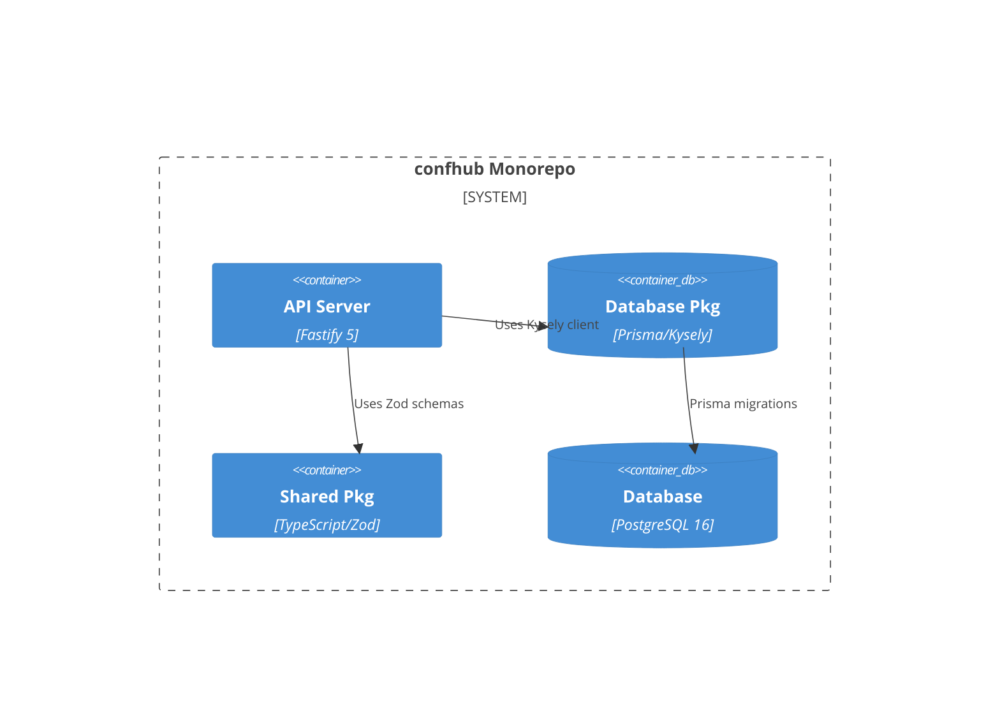

# Implementation Plan: Database Schema & Shared Packages

**Branch**: `00002-db-schema` | **Date**: 2026-05-13 | **Spec**: [spec.md](spec.md)

## Summary
**Goal**: Implement the centralized database and shared types layer for `confhub`.  
**Approach**: Define the Prisma schema, integrate Kysely for type-safe queries, and export Zod validation schemas.  

## Architecture

## Implementation Plan

### Phase 1: Foundational
- [ ] T001 Initialize `packages/db` with Prisma schema.
- [ ] T002 Initialize `packages/shared` with Zod validation schemas.

### Phase 2: Delivery (Priority: P1)
- [ ] T003 Implement User, Event, Session entities in `schema.prisma`.
- [ ] T004 Generate Kysely types.
- [ ] T005 Export Zod schemas for shared entities in `packages/shared`.

## Risk Mitigation
- **Consistency**: Keep Prisma schema and Zod schemas in sync via auto-generation.
