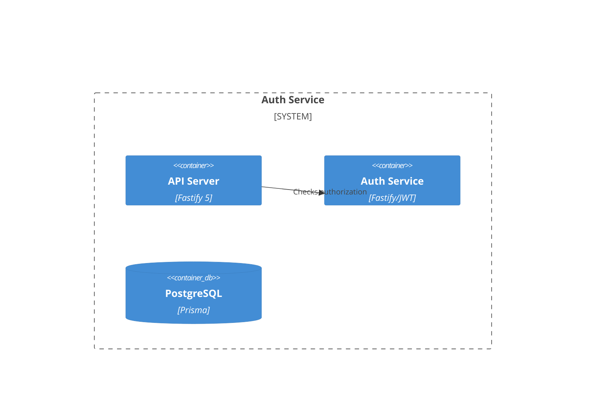

# Implementation Plan: Auth Service

**Branch**: `00003-auth-service` | **Date**: 2026-05-13 | **Spec**: [spec.md](spec.md)

## Summary
**Goal**: Implement secure JWT-based authentication and RBAC middleware.  
**Approach**: Define auth service and protect routes with RBAC middleware.

## Architecture

## Implementation Plan

### Phase 1: Delivery
- [ ] T001 [OBJ1] {TR-001} Implement Fastify JWT authentication and session handling in `apps/api/src/services/auth`.
- [ ] T002 [OBJ2] {TR-002} Implement RBAC middleware in `apps/api/src/middleware/auth.ts`.
- [ ] T003 [OBJ1] {TR-001} [COMPLETES TR-001] Implement login/refresh endpoints in `apps/api/src/routes/auth.ts`.

## Risk Mitigation
- **Security**: Use `__Host-` cookie prefix for refresh tokens.
